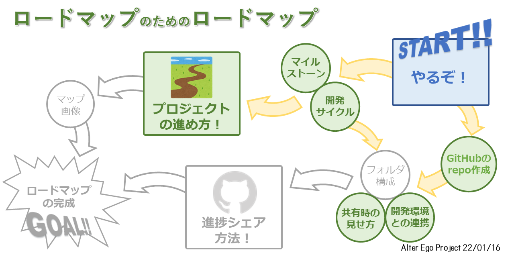

# 電脳生物へのロードマップ

**プログラムに人間のようにゲームを遊んで欲しい**

という方向性で電脳生物を開発しています。

YouTubeのライブ配信( https://www.youtube.com/c/AlterEgoProject/live )で実際にプログラムを動かしていて、現在「あつまれ どうぶつの森」のプレイを題材に学習機構などの構築を目指しています。

# 進捗

# ロードマップ4ロードマップ (22/01/16)
**プロジェクトの進め方の決定**
- [x] マイルストーンの設定
    - 電脳生物の完成 << 電脳生物の雛形 (進化・学習環境) < 感情・ 記憶機構 < 各種入出力
    - 入力: ゲーム画面, 音声, チャットの入力
    - 出力: コントローラー, チャット (, 3Dモデル, 合成音声?) の出力
    - 感情機構: 特定の情報に対して快・不快を設定
    - 記憶機構: 何かを覚えておく、学習とは別の短期・長期記憶
    - 学習環境: 電脳生物に学習するための教師 (深層学習)
    - 進化環境: 電脳生物の進化アルゴリズム (遺伝的?)
- [x] 開発サイクルの形式化
    - マイルストーン/小目標を達成できるようプロセスを細分化
    - 細分化したプロセスを設計
    - コーディング&テスト
    - 必要に応じて全体のコードを再設計
    - ビジュアル化

**進捗シェア方法の決定**

- [x] GitHubリポジトリの作成
- [x] 開発環境との連携
    - ローカルへクローン
    - PyCharm との連携
- [ ] フォルダ構成のフォーマット
    - マイルストーン/中目標/小目標?
- [x] SNS共有時の見え方の調整
    - 進捗画像の変更 ( https://github.com/AlterEgoProject/RoadMap/settings )
    - Twitter Card の更新 ( https://cards-dev.twitter.com/validator )

**ビジュアル化**
- [ ] ロードマップの画像作成
